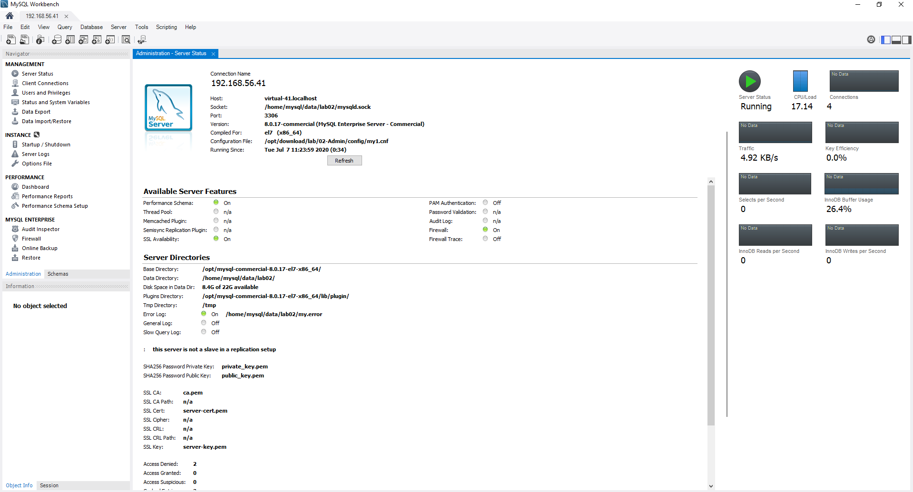
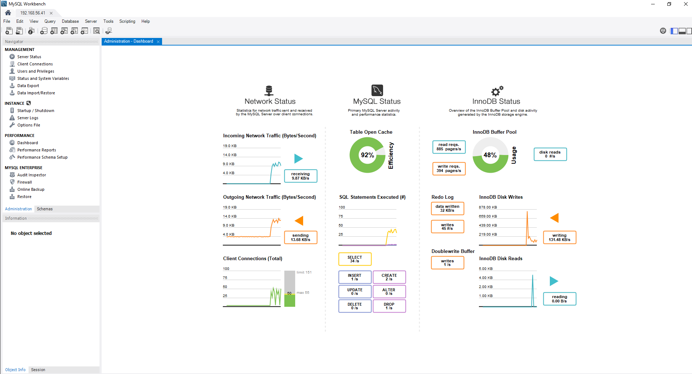
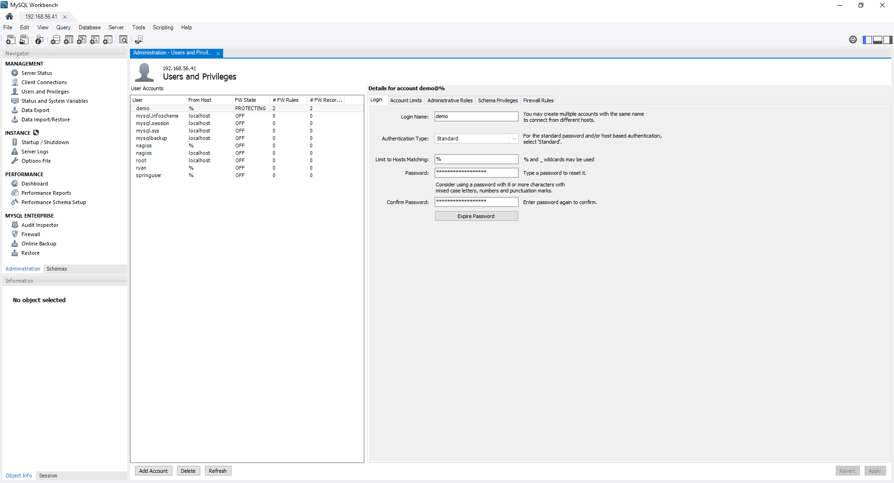
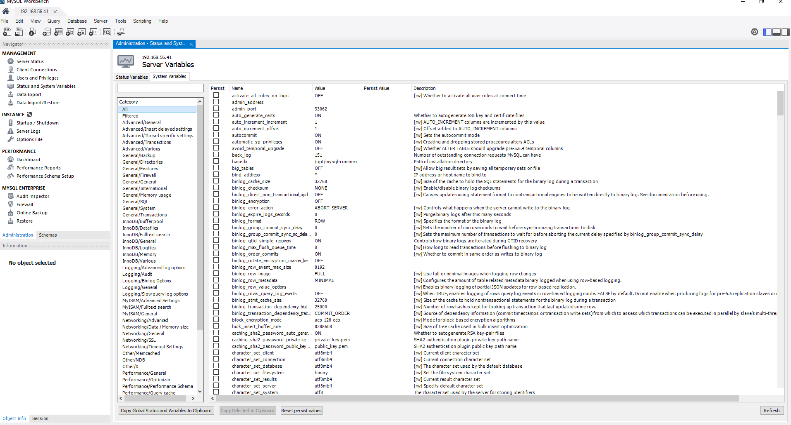
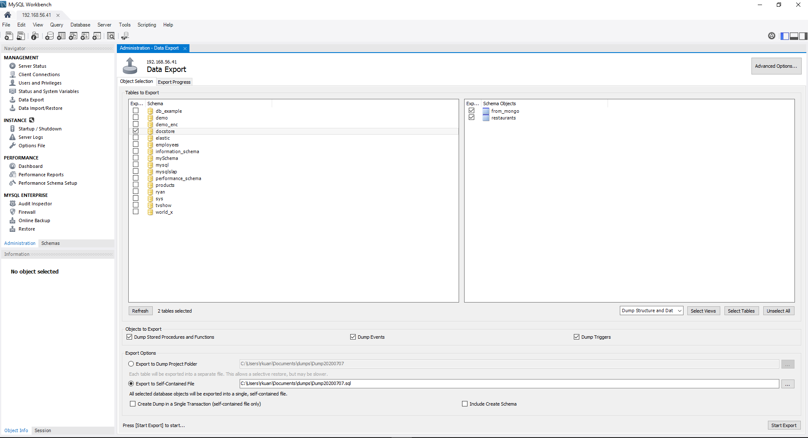
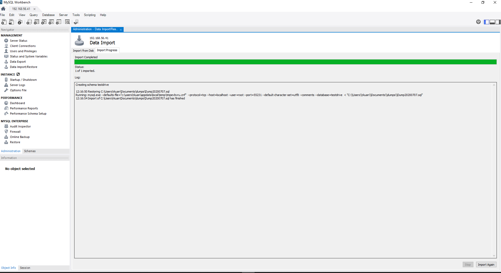

# Lab 1: Navigate the MySQL Engine

The MySQL server is up and running at the OCI compute instance, we will use MySQL Workbench to navigate the the database engine:
* Engine Status
* Engine Dashboard
* Engine Log

## Engine Status (is it running? how much is the CPU utilization, etc)

There are 2 tabs in the **Navigator** panel of the Workbench
* **Administration**
* Schemas

We will use the **Administration** to navigate engine, first we will look at the **Server Status**
* The host information
* Server features (including Enterprise Features)
  * These features can be turned on and off dynamically
* Server directories
  * where is the data stored int the system
  * error messages log file
  * general query log file
  * slow query log file



## Engine Dashboard

Once you have check out MySQL engine status, you can look at the engine dashboard to check out the health status
Now we can take the engine for a quick test drive to see how it performs. To do that, we will run a small load on the engine, so that you can see the live statistics displayed on the dashboard on how is the database engine performs 

1. In your ssh terminal, execute the following command (we are simulating 50 users running against the engines)

```
mysqlslap --delimiter=";" --create="CREATE TABLE a (b int);INSERT INTO a VALUES (23)" --query="SELECT * FROM a" --concurrency=50 --iterations=200
```

2. In the dashboard, you will see the 3 main indicators showing performance statistics

* Network traffic
* SQL execution rates
* Engine resource utilization




## Client Connections

On **Client Connection**, you can look at who are the users currently connecting to the database engine
You should see at least 50 connections using the database engine



## Engine server error messages log

On **Server Logs**, you can monitor the engine message log for error, warning, alert







