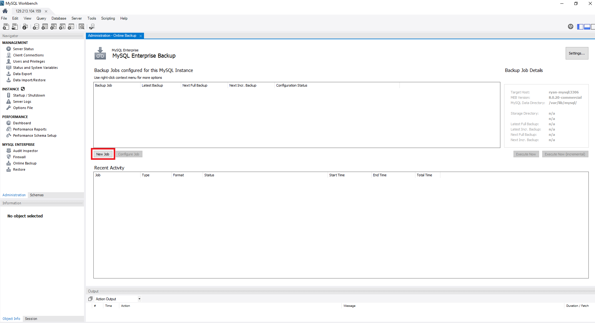
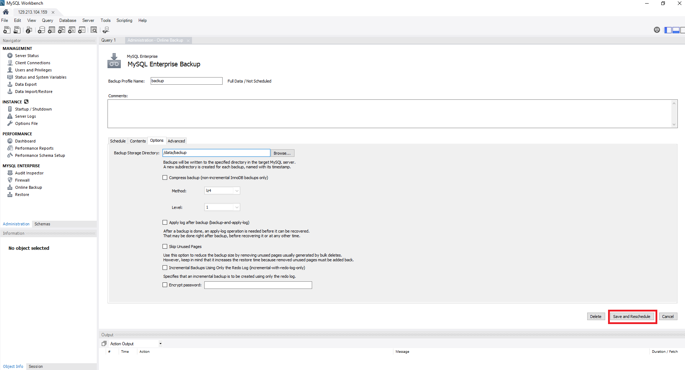
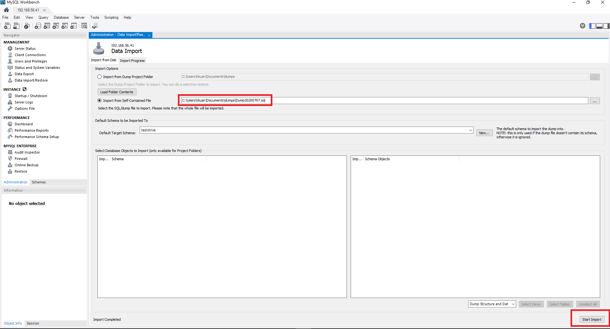

# Test Drive 2: Backing up data

One of the most important tasks of working with database engine is to backup the data to prepare for unforeseen situations when data needs to be restored from backup

**MySQL Enterprise Backup** is a must-have tool for data backup and restore. It is designed for 24x7 data operations where database engine is not allowed to be shutdown and you need to run your backup task online without impacting the data operation

## Backing up data using MySQL Enterprise Backup

In the **Administration** tab, select **Online Backup**

1. Configure the basic MySQL Enterprise Backup settings

2. Create a backup job, click on **New Job**

3. Specify the ``backup directory`` **/data/backup**, Clikc on**Save and Reschedule**

4. Run the backup

## [OPTIONAL] Export/Import data

By default, MySQL Workbench uses ``mysqldump`` utility to export the data by writing out data row one by one to in a single SQL file as database backup. If the database size is large, say more than 1TB, the data export process will take a long time to complete, and restoring data by using the **import** function will take more than triple of the export time. 

The most reliable data backup option is to use 
> **MySQL Enterprise Backup** feature to backup/restore data faster and safer
> **MySQL Enterprise Backup** backup the _physical_ data files therefore it is very fast comparing to ``mysqldump``

You must use **MySQL Enterprise Backup** to backup your important data becuase data is now a corporate asset and it has to be treated with utmost importance. You can export data in row format as an additional data copy but you must use **MySQL Enterprise Backup** as your main backup tool

## Exporting the data

In the **Administration** tab, use the **Data Export** function to export the data out of the database engine

1. Select the **database** you want to export, and select if you want to export selective tables or all the tables
2. Specify the location of the export file in your local directory
3. **Start Export**

You can check out **Advanced Options** if you want to backup the data using advanced features such as compression, exporting table statistics, etc. For now, this is just for your information that there are many options you can specify to customize your data export

## Import the data

You must test your data export by testing the data import to validate the data export is good for restore purpose

To test the data import, create a new dummy database to import the data

