# Test Drive 2: Backing up data

One of the most important tasks of working with database engine is to backup the data to prepare for unforeseen situations when data needs to be restored from backup

**MySQL Enterprise Backup** is a must-have tool for data backup and restore. It is designed for 24x7 data operations where database engine is not allowed to be shutdown and you need to run your backup task online without impacting the data operation

## Backing up data using MySQL Enterprise Backup

1. Start up **MySQL Workbench**


2. Right click on the **Local Instance 3306**, select **Edit Connection**


3. Click on **Store in Keychain** to enter root password
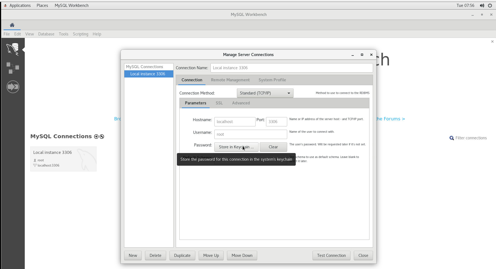

4. Click on the **System Profile** tab, make sure the **System Type** and **Installation Type** are selected with the correct values (**Linux** and **Oracle Linux 7 (MySQL Package)**
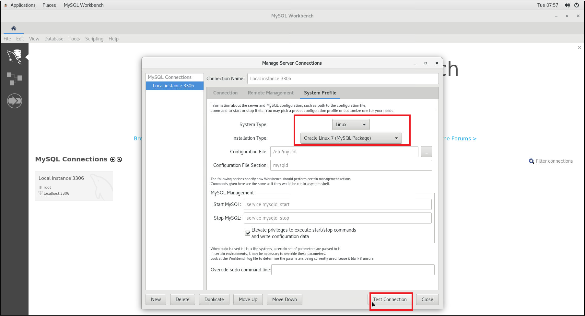, Click on **Test Connection**

5. Once you have tested the connection successfully, click on **Close**

6. Next double click on the **Local Instance 3306** to connect to the database

7. Select **Online Backup**, you may be prompted for opc password, enter the password


8. You would need to configure the correct values for backup
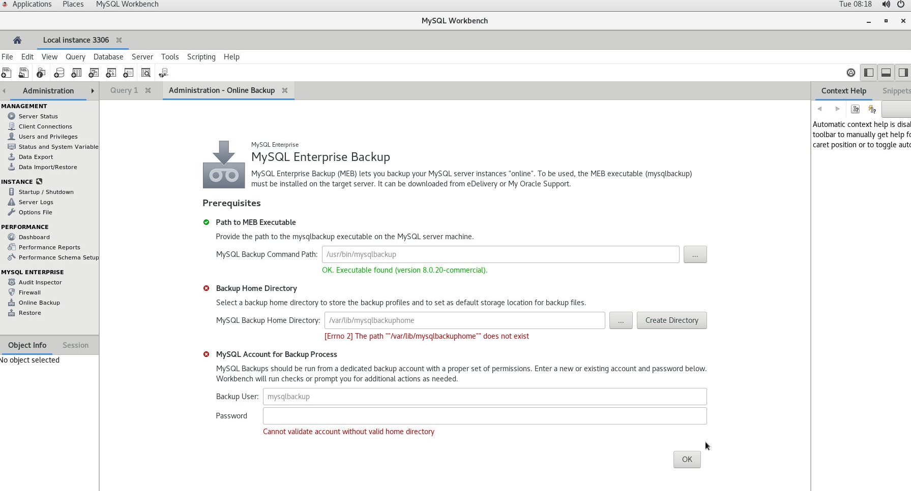

9. Specify **/data/backup** for the **Backup Home Directory**, this is where you would store the database backup files. We will need to create a user called **mysqlbackup**, specify the password, click on **Create MEB Account**
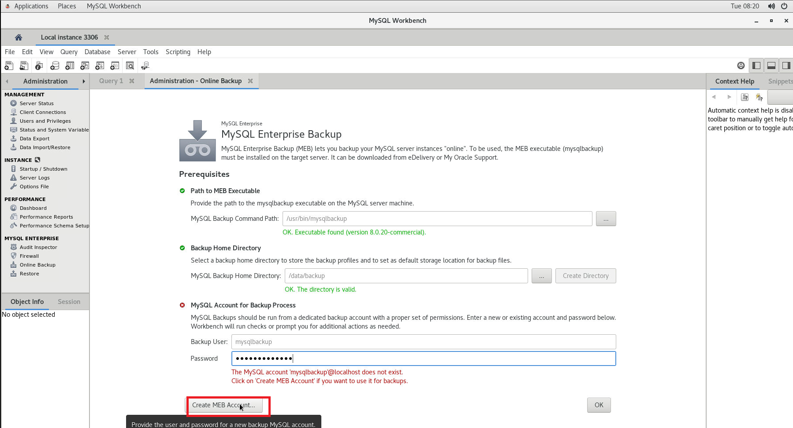

10. You will be prompted to enter the password
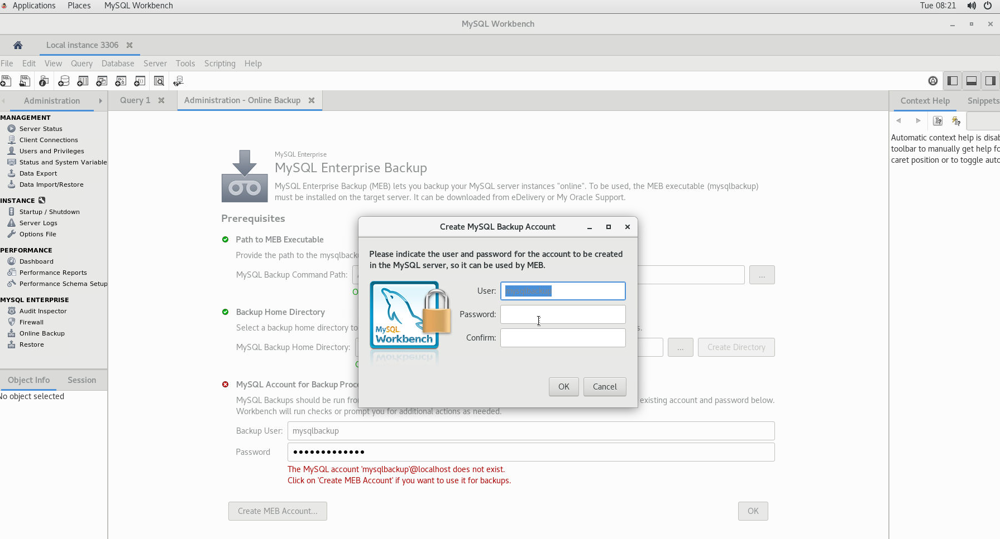

11. Once all the fields are filled, click on **OK**
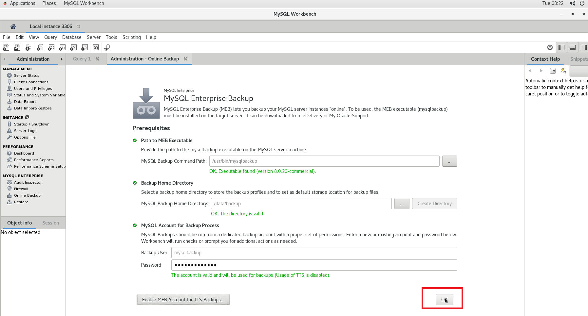

12. On the next screen, you will create a backup job. Before we go on to create a backup job, switch to **Query 1** tab to execute a script
```
grant select on *.* on mysqlbackup@localhost;
```
Click on the highlighted icon to execute the script. Once you are done, select the **Administration - Online Backup**


13. Click on **New Job**
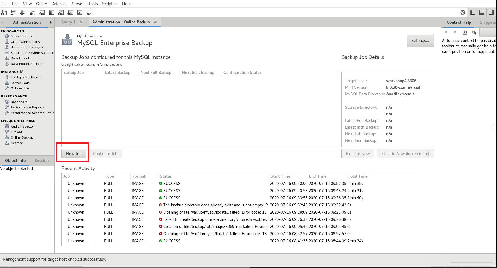

14. For simplicity, we will just take all the default options. On the first tab **Schedule**, you can specify when do you want the backup job to run, we will leave it as is


15. On **Contents** tab, make sure **Backup full contents of this MySQL instance** is selected, all databases will be backup
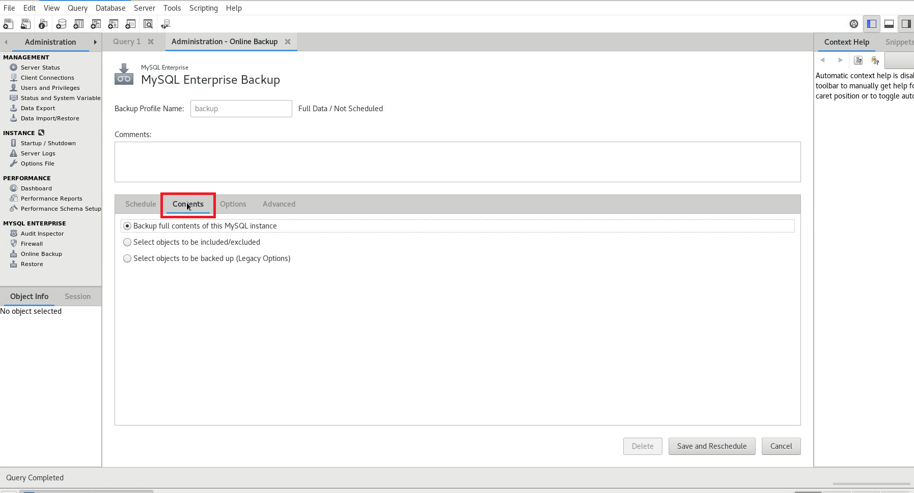

16. On **Options** tab, you can specify lots of different options such as compression, encryption if you want to. We will take all the default
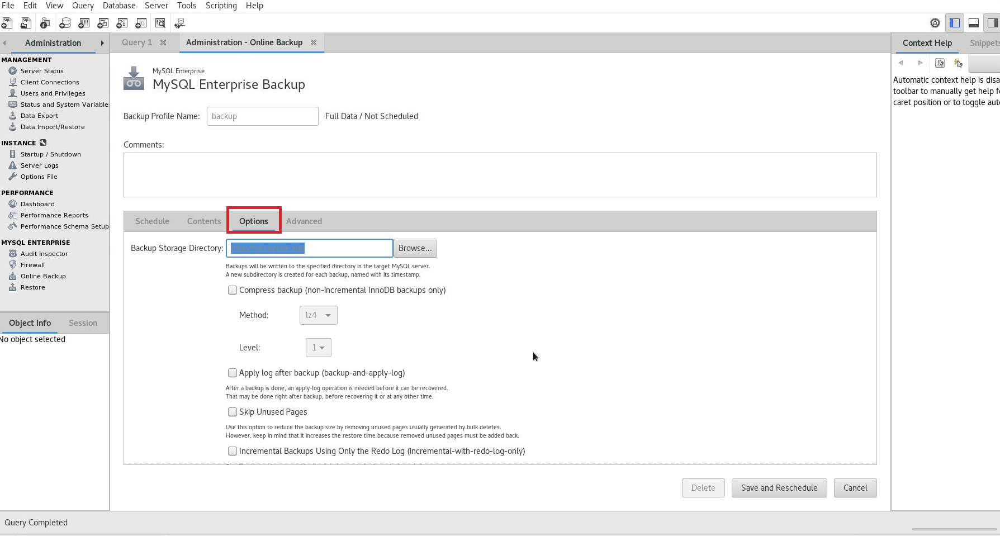

17. On **Advanced** tab, you can further specify custom commands if need to, we will leave it empty, Click on **Save and Reschedule** to complete
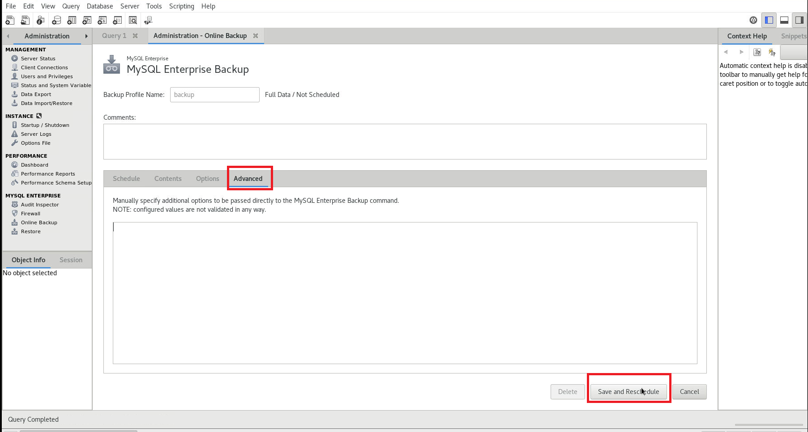

18. You will be prompted to create the directory, click on **Create**
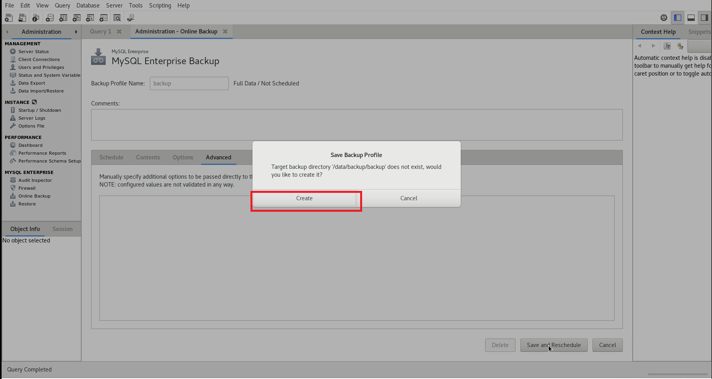

19. We have created a backup job, but we can click on **Execute Now** to kick off the backup
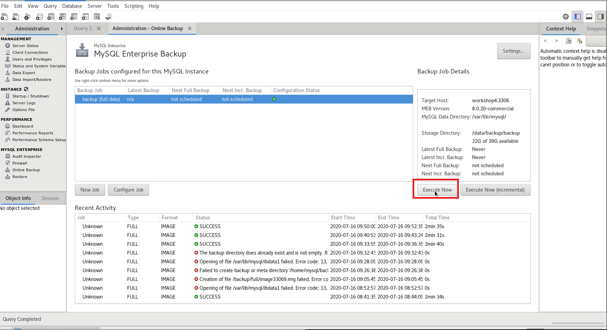

20. You will see a progress window opened with messages, wait for the message **mysqlbackup completed OK!** before closing the window


21. Congratualations! You just completed your first mysqlbackup task! Bravo!

## Comparing MySQL Enterprise Backup with mysqldump

**MySQL Enterprise Backup** is an essential tool for enterprise database deployment. Besides *mysqlbackup* there is a database export tool, ``mysqldump`` utility to export the data by writing out data row one by one to in a single SQL file as database backup, this is the only tool available in MySQL Community Edition. If the database size is large, say more than 1TB, the data export process will take a long time to complete, and restoring data by using the ``mysqldump`` will take more than triple of the export time. 

The most reliable data backup option is to use 
> **MySQL Enterprise Backup** feature to backup/restore data faster and safer
> **MySQL Enterprise Backup** backup the _physical_ data files therefore it is very fast comparing to ``mysqldump``

You must use **MySQL Enterprise Backup** to backup your important data becuase data is now a corporate asset and it has to be treated with utmost importance. You can export data in row format as an additional data copy but you must use **MySQL Enterprise Backup** as your main backup tool

## Comparison of **mysqlbackup** and **mysqldump**

We will run both **mysqlbackup** and **mysqldump** to compare the backup performance so that you would appreciate the value of using an enterprise-grade backup tool for your mission critical database

In this quick lab, ``ssh`` to the compute instance

0. Check the database size

```
cd ~/TestDrive/testdriver-2
./dbsize.sql
```

1. Run mysqldump 

```
cd ~/TestDrive/testdriver-2
./01-mysqldump.sh
```
At the end of the script, please note the time taken for the mysqldump

```
real    0m33.696s
user    0m13.976s
sys     0m1.719s
```

2. Run mysqlbackup

```
cd ~/TestDrive/testdriver-2
./02-med-backup-image.sh
```
At the end of the script, please note the time taken for the mysqldump

```
real    2m34.512s
user    0m3.330s
sys     0m6.241s
```

To compare the time (the actual execution of the backup process which are *user* and *sys* time) taken of mysqldump ``15.695s`` (13.976s + 1.719s) and mysqlbackup ``9.571s`` (3.333s + 6.241s)


Clearly mysqlbackup is faster than mysqldump. Yey!
