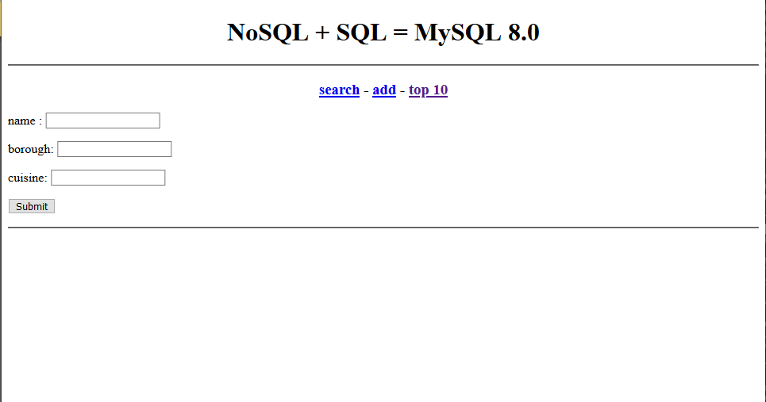

# Working with JSON documents 

Javascript Object Notation (JSON) document is the de-facto data structure used in most of the mobile and web application these days
MySQL supports JSON documents natively in the database engine leveraging all the enterprise database engine functions such as transaction control, replication, backup, etc

MySQL Shell is the newest tool designed for cloud-native application development using popular programming languages of choice such as Python and JavaScript. If you are a full-stack developer, you will find ``mysqlsh`` is a great tool to work with JSON in MySQL. 

With native support for JSON, SQL is now optional for full-stack developer, you can use your favourite CRUD API to work with JSON documents in MySQL. However, we believe you will enjoy a lot more benefits if you combine the power of SQL and MySQL functions together with JSON to create flexible/robust mobile/web appliations:

> You can generate commonly used keys from JSON as columns for SQL query and reporting. SQL is very good to generate **report and analysis**
> You can leverage MySQL transaction management capabilities to rollback/commit changes in JSON document for realiable data consistency

## JSON in action

0. We will upload a set of JSON documents into the database. We will use the sample ``restaurants`` data set exported from mongodb

```
cd ~/TestDrive/testdrive-4/
ls from_mongo.json
mysqlsh
\c root:mysql@localhost:33060
\u docstore
util.importJson("./from_mongo.json", {schema: "docstore", collection: "restaurants", convertBsonOid: true});

```
Once the JSON documents are imported, you can run the sample application 

1. Launch the demo restaurant application (written in PHP with MySQL XDevAPI, a powerful modern API for CRUD application)
Point your browser to http:://ip_address/restaurant/




## [BONUS] Interact with JSON using CRUD API with MySQL Shell


### Using MySQL Shell with JSON

We will use mysqlsh to query JSON documents stored in MySQL which you have used in the demo PHP application

```
mysqlsh
\js
\c root:mysql@localhost:33060
\u docstore
var r=db.getCollection('restaurants')
r.find().limit(2)
```

```
r.find().fields("name", "cuisine").limit(2)
r.find("cuisine='Bakery'").fields("name", "cuisine").limit(2)
r.find("cuisine in ('Turkish', 'Italian')").fields("name", "cuisine").limit(10)
r.find("cuisine='Italian' and borough!='Manhattan'").fields("name", "cuisine", "borough").limit(2)

\sql
with cte1 as (select doc->>"$.name" as name, \
doc->>"$.cuisine" as cuisine, \
(select avg(score) from json_table(doc, "$.grades[*]" columns (score int path "$.score")) as r) as avg_score from restaurants) \
select *, rank() over (partition by cuisine order by avg_score desc) as 'rank' \
from cte1 order by 'rank', avg_score desc limit 10;
```
